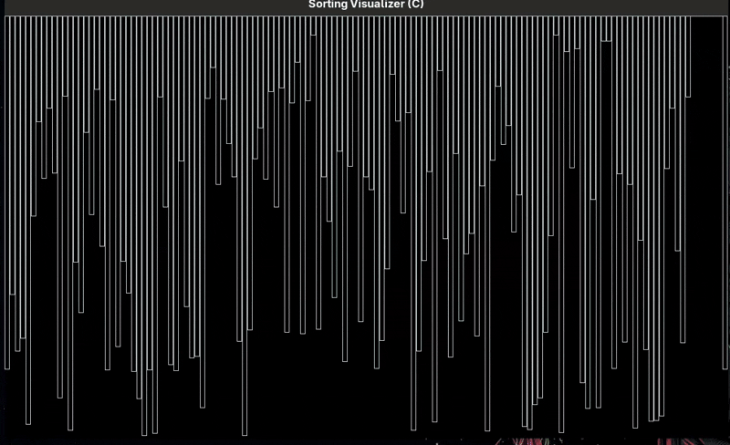

# SORTING ALGORITHM VISUALISER

> A small program to visualize sorting algorithms built from scratch in **C** with **SDL2**.
Real-time tool to watch arrays sort themselves bar by bar!

##  Prerequisites
This project requires **GCC**, **Make**, **pkg-config** and **SDL2**
### Install SDL2
|         OS        | Command                                      |
|-------------------|----------------------------------------------|
| Fedora / RHEL     | `sudo dnf install SDL2-devel`                |
| Ubuntu / Debian   | `sudo apt install libsdl2-dev`               |
| Arch / Manjaro    | `sudo pacman -S sdl2`                        |
| openSUSE          | `sudo zypper install libSDL2-devel`          |


## Build & Run

### Clone
```
    git clone https://github.com/mosa-150505/sorting_visualizer.git
```
or
```
    git clone git@github.com:mosa-150505/sorting_visualizer.git
```

### Compile
`make`

### Run
`make run`


## Demo


 ## Acknowledgments
This project was inspired by [**dipesh-m/Sorting-Visualizer**](https://github.com/dipesh-m/Sorting-Visualizer), originally written in **C++**.
I rewrote it in **C** and  **SDL2** to explore systems programming, memory management, and graphics rendering from scratch.

Special thanks to the original author for the concept and visual design ideas.
